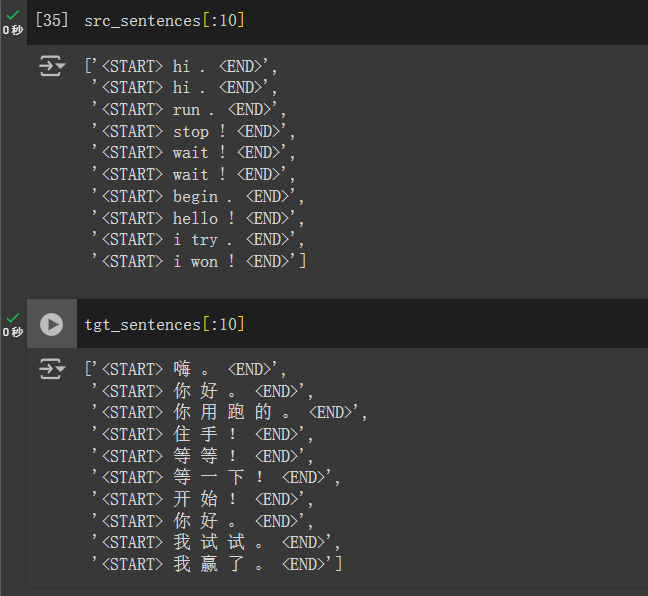

# 英文-中文翻譯器

## 摘要
此專案實現了一個英文-中文翻譯模型，使用序列到序列（seq2seq）的 LSTM 網路架構和注意力機制。模型的效能通過 BLEU 分數來進行評估。

## 資料來源
訓練此模型所使用的數據來自[Anki](https://www.manythings.org/anki/)提供的免費數據集，此網站提供了各種不同國家的語言，提供多語言的句子對，包含英文和中文的翻譯對應資料。

## 資料前處理
在將數據輸入到模型之前，進行了以下前處理步驟：

- 英文和中文句子的分詞處理。
- 將句子補齊（Padding）以保持輸入長度一致。
- 將文本序列轉換為整數表示（單詞 ID）以便模型處理。  

此數據原本樣子為

把所有的英文句子和中文句子各提取出來，經過一系列預處理，使數據變成下圖的樣子  

最後再將數據向量化

## 模型架構
該模型基於 序列到序列的 LSTM 架構，並加入 Luong 注意力機制。具體架構如下：

- 編碼器（Encoder）：一個雙層 LSTM 網路，負責處理輸入的英文句子。
- 解碼器（Decoder）：另一個雙層 LSTM 網路，用於生成中文翻譯。
- 注意力機制：Luong 注意力層計算編碼器和解碼器隱藏狀態之間的對齊分數，使模型在翻譯時能關注到輸入句子中相關的部分。

## 模型訓練與評估
該模型在預處理過的數據上進行訓練，並通過 BLEU 分數 來衡量模型預測的翻譯與參考翻譯之間的相似度。

## 結果
模型達到了95以上的 [BLEU](https://en.wikipedia.org/wiki/BLEU) 分數。結果顯示模型在英-中翻譯方面具有效果，但在處理罕見或複雜句子結構時仍有改善空間。

## 未來展望
未來計劃包括：

- 由於硬體計算能力和記憶體有限，只能使用少量數據集來做訓練(10000筆)，希望日後有機會使用更大規模的數據集與硬體設備來提升模型效能。

- 嘗試使用如 Transformer 之類的更先進的架構。

- 調整超參數和訓練技巧，以提高翻譯準確度。
